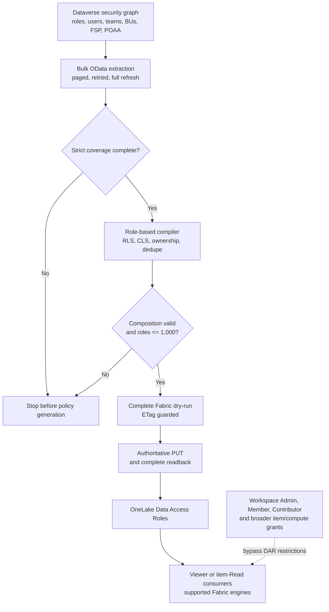

# Policy-Weaver Dataverse Security Mission Report

**Assessment date:** 2026-09-02 
**Target estate:** approximately 450 Dataverse security roles, 12,500 users, and 25 column security profiles 
**Target platform:** Microsoft Fabric OneLake Security, generally available since May 2026 
**Customer-specific quota:** 1,000 OneLake security roles per target item, approved through Microsoft support 
**Assessment basis:** current working-tree source, tests, generated evidence, Microsoft documentation, upstream GitHub history, and Squad review

## Executive decision

Policy-Weaver has progressed well beyond a proof of concept. The current Dataverse connector is a real, guarded policy compiler with bulk extraction, pagination, BU-aware RLS, Basic-owner isolation, CLS grouping, role/member/permission/predicate capacity checks, Fabric dry-run, ETag concurrency, idempotent reconciliation, and readback verification.

It is nevertheless **not ready to claim full Dataverse authorization parity for the bank estate**.

The correct decision is:

- **NO-GO for bank-wide production exact parity today.**
- **CONDITIONAL GO for an isolated pilot** limited to tables and personas for which unsupported Dataverse mechanisms are proved absent, Fabric bypass permissions are removed, strict compilation succeeds, the projected role count is below the confirmed 1,000-role quota, and persona-level row and column comparisons have zero mismatches.
- **Continue engineering toward an effective-entitlement compiler**, but do not promise that fingerprinting will reduce the bank estate below 1,000 roles. Basic ownership and other principal-specific predicates remain inherently high-cardinality.
- **Use a different governed enforcement architecture for dynamic record relationships** such as POA sharing, arbitrary RecordFilter FetchXML, hierarchy security, and masked-value presentation unless a restricted, equivalence-proved translation is possible.

The 1,000-role support increase removes one administrative blocker. It does not remove role amplification or OneLake's semantic limits.

## Evidence vocabulary

This report uses the following labels:

- **Implemented:** present in the current working-tree source.
- **Tested:** covered by current automated tests.
- **Observed:** measured against a tenant/item or generated report; not necessarily universal.
- **Documented:** stated in current Microsoft documentation.
- **Customer input:** supplied by the user or customer, but not independently reproduced.
- **Unsupported:** not represented exactly by the current connector and target enforcement model.
- **Unknown:** customer data or platform evidence is still required.

Passing unit tests prove implementation consistency. They do not prove that Dataverse and Fabric return identical rows and columns for a real principal.

## The problem

Dataverse data can be mirrored into Fabric, but data movement alone does not preserve authorization. Dataverse evaluates a cumulative security graph:

1. The principal must have a table privilege through a direct role or a team role.
2. Record access is then accumulated through ownership, BU-scoped role access, sharing, and hierarchy access.
3. Team ownership and role inheritance affect Basic access.
4. Multiple direct and inherited roles accumulate, with the greatest valid access prevailing.
5. Field security profiles add secured-column grants.
6. POAA can add field access for one specific record.
7. Masking and `CanReadUnmasked` change the value that a user may retrieve.

OneLake security is also grant-based and cumulative, but its native Data Access Roles are not a Dataverse authorization engine. The connector must compile one security model into another without adding or removing access. For a bank, an overgrant is a confidentiality incident and a material undergrant makes the analytical product unusable.

The required invariant is:

> For every in-scope principal, table, record, column, and supported access path, Fabric must return exactly the data that Dataverse permits, and no more.

That invariant includes alternate Fabric workspace, item, SQL, semantic-model, shortcut, and export paths. Correct Data Access Roles alone are insufficient if another permission grants broader access.

## What the connector is

The reviewed component is an **external synchronous Python extractor, compiler, and reconciler**. It is not a native Dataverse plug-in and does not execute inside the Dataverse transaction pipeline.

The current flow is:

1. [Dataverse API extraction](../../policyweaver/plugins/dataverse/api.py) reads organization hierarchy settings, business units, active users, teams, assignments, role instances, role privileges, field profiles, column metadata, and POAA.
2. [Dataverse models](../../policyweaver/plugins/dataverse/model.py) hold the in-memory security graph and indexed lookups.
3. [Dataverse policy mapping](../../policyweaver/plugins/dataverse/client.py) validates coverage, resolves identities, calculates RLS/CLS, isolates principals where required, chunks the result, and rejects unsupported or over-cap mappings.
4. [Fabric orchestration](../../policyweaver/weaver.py) serializes roles, validates the currently managed DAR boundary, performs an exact dry-run, applies the complete collection with an ETag, and verifies the readback.
5. [Fabric REST handling](../../policyweaver/core/api/fabric.py) pages through current roles and sends `dryRun` and `If-Match` requests.

Trust crosses Dataverse, Microsoft Entra ID and Graph, local configuration and evidence, the Policy-Weaver compiler, the Fabric REST API, and every Fabric query engine used by consumers.

The dashed path is why target-boundary governance is a production requirement rather than an optional operational enhancement.

## Current capability

### Extraction and normalization

The connector currently:

- Uses OData `$select` and `$expand` rather than downloading full entities.
- Follows top-level and expanded `@odata.nextLink` values.
- Rejects malformed collections, pagination cycles, and cross-origin next links.
- Uses bounded GET retries for throttling and transient server errors.
- Bulk-loads users, teams, relationships, roles, role privileges, profiles, and field permissions rather than issuing a request per role or principal.
- Resolves child-BU role instances through their root role's privilege definitions while retaining the child role's BU context.
- Treats only masks 1, 2, 4, and 8 as Basic, Local, Deep, and Global.
- Treats unknown masks, including mask 16, as Unknown rather than Global.

This is a meaningful scalability and security improvement over a naive user-by-role-by-table join.

### RLS mapping

Current Fabric predicates use mirrored table columns, not Dataverse Web API lookup aliases:

- **Global:** no row constraint.
- **Deep:** `owningbusinessunit in ('role BU', 'descendant BUs', ...)`.
- **Local:** `owningbusinessunit = 'role BU'`.
- **Basic:** `ownerid in ('principal ownership IDs', ...)`.
- **Unknown:** `false`, denying all rows.

That depth fallback is fail-closed. It does not compensate for an undiscovered secured table; metadata completeness is a separate production blocker.

The compiler also adds personal or owner-team ownership overlays when Local or Deep BU scope alone would omit records that the principal owns outside that scope.

Within a Dataverse role instance and table, the highest recognized depth wins. Across generated OneLake roles, Microsoft documents union semantics and combines RLS predicates with `OR`. This preserves additive access for uncomplicated cross-role combinations, including Deep in one BU plus Local in another.

### Multiple roles and teams

The connector currently:

- Deduplicates direct user-role and team-role assignments.
- Preserves role-instance BU context.
- Expands non-Entra teams to their resolvable users.
- Can use an Entra-backed team as one Fabric group member on a shared policy path.
- Splits Basic access per effective identity so two users do not receive each other's owner IDs.
- Accounts for the Dataverse team's member-privilege inheritance mode when deriving personal and team ownership.
- Includes owner-capable team IDs and excludes access teams from ownership predicates.

Strict mode rejects role-assigned or field-profile-assigned Entra group teams because the current Dataverse snapshot cannot prove dynamic or filtered Entra membership equivalence.

### Column security

The connector extracts field security profiles, profile assignments, and field permissions. A `canread` value of 4 grants a secured column. Grants from multiple applicable profiles accumulate.

Users with different effective column allowlists are separated into different generated roles. Users with identical allowlists can share a role, subject to the 500-member limit. A user with no readable columns for a secured table receives an empty allowlist and the table is removed from that generated role rather than exposed.

This is a useful CLS foundation, but it is not complete Dataverse column-security parity because masking, `CanReadUnmasked`, POAA, System Administrator behavior, and metadata completeness remain unresolved.

### Capacity and publication controls

The connector enforces:

- 500 users or groups per OneLake role.
- 500 permissions per OneLake role.
- A configured target role quota, set to 1,000 for this customer.
- A configurable row-predicate chunk budget, currently 4,096 characters.
- Preflight capacity checks before principal expansion.
- A final capacity check after member, permission, and row-predicate splitting.
- Strict source validation before Fabric operations.
- Complete Fabric `dryRun=true` validation.
- ETag-based optimistic concurrency.
- Canonical no-op detection and complete post-apply readback.

The 4,096-character boundary is **observed**, not a maximum declared by the REST schema. A July 2026 dry-run accepted 4,096 characters and rejected 4,097 for the tested item. A real PUT, GET, and query-enforcement boundary test remains outstanding.

## Security-mechanism verdict

| Mechanism | Current verdict | Security effect |
| --- | --- | --- |
| Direct roles and cumulative depth | Implemented and tested | Correct for supported depths and role combinations |
| Root/child BU role instances | Implemented and tested | Retains role BU context while using root privileges |
| Basic owner isolation | Implemented and tested | Prevents peer-owner overgrant; can cause role explosion |
| Local and Deep BU scope | Implemented and tested | Requires complete, coherent BU topology |
| Owner-team ownership | Implemented and tested | Adds owned-team records when the privilege and inheritance permit them |
| Access-team sharing | Unsupported through the POA gap | Normally undergrant if omitted |
| Entra group-team role/FSP assignments | Strict blocker | Avoids unproved dynamic membership equivalence |
| Field security profiles | Partially implemented | Core grants work; masking, POAA, admin bypass, and completeness are gaps |
| POA record sharing | Not extracted | Strict mode requires external evidence that relevant read shares are absent |
| POAA field sharing | Extracted, not translated | Strict mode blocks when readable POAA records exist; omission would undergrant |
| RecordFilter | Detected, not translated | Strict mode blocks; non-strict output denies those rows and undergrants |
| Manager/position hierarchy | Detected, not translated | Strict mode blocks; omission would undergrant |
| Masking and `CanReadUnmasked` | Not extracted or represented | Can expose original values when only masked values are permitted |
| System Administrator CLS bypass | Not represented | Undergrants administrators unless they are excluded or handled explicitly |
| Unknown user eligibility | Nullable states can be accepted | Potential overgrant when eligibility is ambiguous |
| Impersonation/delegation | Not modeled | Must be excluded or separately governed |

### Customer Service Workspace impact

The current and future CSW models stress different parts of the compiler:

- **Current state:** team-owned cases and overlapping team membership rely heavily on ownership and sharing. Owner-team ownership is represented for supported role paths, but access-team and direct record-sharing exceptions depend on POA. A CSW pilot cannot claim parity merely because team-owned cases work; assist-case and other shared-record paths must be inventoried separately.
- **Future state:** stronger BU hierarchy and multi-persona users increase reliance on Local/Deep unions across role instances. The BU-aware compiler can represent supported static scopes, but cross-BU ownership overlays, role amplification, and mixed RLS/CLS composition become more likely. Future-state design must be capacity-tested from actual assignments rather than assumed to be simpler.

Migration must preserve both paths during coexistence. A BU-first future design does not make current team and sharing entitlements disappear on the cutover date.

## Production blockers

### 1. Alternate Fabric access planes

Current strict validation checks the DefaultReader role and unmanaged OneLake Data Access Roles. It does not inventory workspace roles, item permissions, SQL endpoint mode and permissions, semantic model permissions, shortcuts, or exported derivatives.

Microsoft documents that workspace Admins, Members, and Contributors are not restricted by OneLake RLS or CLS. Therefore, exact parity cannot be asserted until every mapped consumer's alternate grants are inventoried and continuously controlled.

### 2. Masking and unmasked values

Dataverse field permissions include `CanReadUnmasked` states of Not Allowed, One Record, and All Records. Masking rules determine the displayed value. The connector currently extracts only `canread`.

OneLake CLS grants or hides a column; it does not transform an original value into the Dataverse masked presentation. If Fabric stores the original value, granting the column to a masked-only user is an overgrant. Full parity requires one of:

- Proof that no in-scope secured column uses masking.
- A downstream physical masking process with equivalence evidence.
- A different enforcement path capable of the required value transformation.

### 3. Incomplete secured-column discovery

The connector first discovers tables with secured attributes and then loads detailed metadata. A structurally valid but incomplete `EntityDefinitions` response can omit a secured table. The mapper then treats that table as unconstrained.

This is a fail-open path. Every readable candidate table must have an explicit, completeness-proved metadata result before strict publication.

### 4. No coherent source snapshot

The extractor runs several independent, sequential OData queries with no common source version or mutation detector. Paging is complete, but the resulting authorization graph can mix points in time.

A membership removal, role-depth change, BU move, or field-profile update during extraction can produce transient overgrant or undergrant. Deterministic ordering alone does not solve this. The design needs generation evidence, repeated control totals or version checks, cross-reference validation, and restart-on-mutation behavior. Change tracking can be used where compatible, but it is not a drop-in replacement for all expanded queries.

### 5. Dangerous authoritative deltas

Fabric publication is well guarded at the REST boundary, but a structurally valid empty or sharply reduced source result can still become an authoritative replacement. Conversely, a failure before apply leaves old grants in place, creating stale overgrant after a Dataverse revocation.

Production requires a trusted baseline, customer-approved count and deletion budgets, two-person approval for exceptional deltas, a protected before-image, rollback verification, and an alert when target authorization exceeds the permitted staleness window.

### 6. Unrepresentable or unimplemented dynamic access

- **POA:** Microsoft documents record-oriented shared-access APIs such as `RetrieveSharedPrincipalsAndAccess`. This review found no first-party evidence of a supported environment-wide bulk POA collection contract. Treat the current external-attestation requirement as a qualified implementation boundary, not a universal theorem.
- **POAA:** the connector can bulk-read the field-sharing collection, but OneLake table-wide CLS cannot represent a one-record field grant.
- **RecordFilter:** Dataverse stores a FetchXML rule and can recursively filter linked records. A safe translator could support a proven single-table subset, but arbitrary FetchXML cannot be assumed equivalent to current static OneLake RLS.
- **Hierarchy security:** manager and position relationships are dynamic record relationships and are not represented by the current static BU/owner predicates.

Current OneLake security guidance says RLS roles do not support dynamic or multitable queries. The REST schema still contains broader wording. Operational guidance and tenant validation must control until Microsoft reconciles that documentation.

### 7. Scale feasibility

Role count is a function of effective entitlements, not the count of Dataverse role names.

For role instance `r`, before row-predicate chunks:

- Principal-specific ownership: `N(r) = identities(r) * ceil(tables(r) / 500)`.
- Shared access: `N(r) = ceil(members(r) / 500) * ceil(tables(r) / 500)`.
- Divergent CLS: sum the shared-access formula over each distinct column signature.

Predicate chunks can multiply these values further.

Measured synthetic evidence:

- A fresh target-shaped run used 12,500 users, 450 role instances, five roles per user, 25 profiles, 10 BUs, 100 owner teams, and 10 tables per role. Its direct-role RLS baseline, with CLS disabled by design, produced 450 policies, 62,500 memberships, 4,500 table scopes, and 3,000 row constraints in 34.827 seconds at 451.93 MiB peak traced Python allocation.
- In the same run, one Basic role assigned to all 12,500 users was blocked because exact isolation required at least 12,500 roles.
- The synthetic overlapping cross-BU owner-team scenario was blocked at a projected 54,627 roles.
- The synthetic multi-role RLS plus CLS scenario was blocked for 12,500 user-table assignments.

These are stress scenarios, not forecasts of the customer's estate.

The supplied workbook cannot resolve the question. It contains 194 role rows, 60,991 privilege rows, and 19,475 Read grants across 2,044 targets, but contains no users, role assignments, teams, memberships, BU hierarchy, field-profile assignments, POA, or POAA. The reported 450-role estate is therefore not represented completely.

The required customer inputs are:

- User-to-role and team-to-role assignments.
- Team types, membership sizes, inheritance modes, and overlaps.
- BU hierarchy and role-instance BU assignments.
- Effective Read depth per role instance and table.
- Field-profile user/team assignments and secured-column permissions.
- POA, POAA, RecordFilter, hierarchy-security, and masking usage.
- The exact tables mirrored to Fabric.
- Fabric workspace, item, SQL, semantic-model, shortcut, and group grants.

### 8. Mixed multi-role RLS and CLS

Microsoft documents that RLS and CLS which must apply together need to be in the same OneLake role. It does not support a user reaching the same table through roles with different column sets when either role also applies RLS.

This condition is likely in an estate where users hold several Dataverse roles and 25 field security profiles are in use. Policy-Weaver correctly detects and blocks it before publication. It is therefore a production gate, not a warning. The safe engineering direction is to compile each principal's cumulative supported row and column access into equivalent role cohorts; disabling CLS would expose secured columns and is not an exact-parity remedy.

## How close the project is

### Close for a restricted security subset

For a stable environment using only direct/static assignments, Basic/Local/Deep/Global read depth, complete BU metadata, owner-team ownership, unmasked FSP grants, no dynamic sharing or hierarchy, resolvable identities, and a generated role count under 1,000, the connector has a credible logical design. Its core controls are meaningful and the automated test suite is substantial.

### Not close enough for full Dataverse parity

The remaining blockers are not cosmetic. They involve value masking, record-specific grants, dynamic relationships, alternate access planes, source consistency, and high-cardinality ownership. Some require connector work; some require customer security-model constraints; some may require a different enforcement plane.

The current project should be described as:

> A hardened compiler for a strict, explicitly bounded subset of Dataverse read security, with fail-closed detection for several unsupported mechanisms.

It should not yet be described as a complete Dataverse authorization replica.

## Art of the possible

### Option A: Strict native OneLake subset

Use the existing role-based compiler only for tables and personas that pass every strict gate.

Best fit:

- Global, Local, and Deep access shared by coherent cohorts.
- Limited Basic access with low principal cardinality.
- Static users and owner teams.
- No masking, POA/POAA, RecordFilter, or hierarchy security.
- Uniform or safely grouped CLS.

This is the fastest pilot path and can provide exact parity inside the declared boundary. It cannot cover the full estate unless the customer's real entitlement graph fits.

### Option B: Effective-entitlement compiler

Compile the complete supported Dataverse graph into an effective record/column signature per principal and table, then group only principals with identical effective access. The role name becomes an implementation artifact rather than a mirror of a Dataverse role name.

Potential benefits:

- Consolidates multiple source roles before publication.
- Places RLS and CLS that must apply together in the same OneLake role.
- Groups users by actual access rather than source role membership.
- Produces a defensible preflight forecast and access explanation.

Hard limits:

- Different Basic owner sets normally remain different signatures.
- POA, POAA, hierarchy security, masking, and arbitrary RecordFilter still require additional semantics.
- Member, permission, and predicate chunking can still exceed 1,000.
- The current fingerprint code is diagnostic only; no production fingerprint compiler exists.

This is the recommended next compiler architecture, but its value must be measured against the customer's redacted entitlement distribution before implementation is presented as a scale solution.

### Option C: Partition the security domain

Use separate governed Fabric items or physical data projections by business domain, geography, BU, persona, or data sensitivity. Each item receives its own 1,000-role quota and smaller authorization graph.

This can make static OneLake enforcement feasible, but increases data duplication, lineage, lifecycle, query, and operating complexity. Cross-item consumers and shortcuts need their own end-to-end security proof.

### Option D: Governed dynamic enforcement plane

Materialize a Dataverse entitlement bridge containing principal, record, column, grant source, and validity information, and enforce it at query time in a platform that supports the required joins and value transformations.

A Fabric Warehouse or SQL security design is a candidate for a SQL-only consumption boundary. It is not automatically exact and does not automatically protect Spark, Direct Lake, shortcuts, copied data, or privileged workspace users. All consumer paths must be forced through and tested against the chosen plane.

This option is the strongest candidate for POA, hierarchy, high-cardinality Basic access, and other dynamic relationships. It is a separate architecture, not a small Policy-Weaver patch.

### Option E: Deliberately broader analytical access

Some organizations choose a simplified reporting authorization model rather than Dataverse parity. That is a separate product requirement and risk decision. It must not be labeled exact parity, and it cannot be introduced by disabling CLS, merging users with different Basic ownership, or retaining DefaultReader.

## Goals and roadmap

### Immediate: establish a truthful boundary

**Owners:** Architect, Semantics, Governance, Reliability, Tester, Fact Checker 
**Target:** before any further production-target apply

1. Keep the production decision at NO-GO and permit only isolated, non-sensitive dry-runs.
2. Obtain a complete, timestamped, redacted customer entitlement inventory for the exact mirrored table set.
3. Inventory every Fabric control-plane and compute-plane grant for mapped consumers.
4. Prove whether masking, POA, POAA, RecordFilter, and hierarchy security are in active use.
5. Confirm the 1,000-role quota on each target item, not only at tenant or support-case level.
6. Rotate any credential that has appeared in a file, terminal, or chat and use Key Vault or managed identity where available.
7. Record a customer-approved maximum stale-access interval and change-approval model.

### P0 engineering: remove fail-open paths

**Owners:** Architect and Semantics, independently reviewed by Tester and Fact Checker 
**Target:** before a regulated pilot

1. Make secured-table and column discovery complete and fail closed.
2. Extract masking assignments and `CanReadUnmasked`; block unrepresentable states.
3. Detect or explicitly exclude System Administrators using stable metadata.
4. Fail strict mode on nullable or contradictory user eligibility.
5. Fix or remove the alternate `table_permissions.has_read=False` path.
6. Replace process-global Dataverse origin and authentication state with per-run dependencies.
7. Add source-generation and mutation detection with restart behavior.
8. Add trusted-baseline counts, customer-approved delta budgets, approval evidence, protected before-image, and stale-access alerting.

### P1 compiler: test effective-entitlement grouping

**Owners:** Architect, Semantics, Reliability, Tester 
**Target:** pilot design phase

1. Build a read-only effective-entitlement compiler prototype for supported mechanisms.
2. Compare its output per principal/table with the current role-based compiler.
3. Forecast role, member, permission, and predicate counts on redacted customer cardinalities.
4. Proceed to publication code only if every grouping has an equivalence proof and remains below 1,000.
5. Preserve explainability from each generated signature back to source roles, teams, BUs, profiles, and ownership.

### P1 validation: prove behavior, not counts

**Owners:** Tester and Reliability, reviewed by Governance 
**Target:** before pilot promotion

1. Build a dedicated Dataverse sandbox and disposable Fabric item with synthetic identities and records.
2. Cover multiple roles, cross-BU access, direct and team assignments, ownership, uniform/divergent/no-read CLS, application users, and schema changes.
3. Query Dataverse and Fabric as the same test principal.
4. Compare exact primary-key sets and readable column sets, not only counts.
5. Test each supported Fabric engine and block any ungoverned path.
6. Exercise dry-run, real PUT, GET, enforcement, propagation, ETag conflict, rollback, and stale-cache windows.
7. Require zero unexplained overgrants and zero unexplained undergrants.

### P2 architecture: handle dynamic entitlements

**Owners:** Architect and Governance, with Microsoft product validation 
**Target:** production architecture decision

1. Select an enforcement plane for POA, hierarchy, arbitrary RecordFilter, masked values, and high-cardinality Basic access.
2. Prove all consumer paths use that plane or remain independently constrained.
3. Define entitlement refresh, revocation SLA, audit lineage, failure recovery, and incident response.
4. Treat physical partitioning and SQL-only enforcement as design options requiring separate proof, not assumed solutions.

## Pilot entrance criteria

A pilot may begin only when:

- The target contains synthetic or approved non-sensitive data.
- Every consumer is a Viewer or has only the item permission required for OneLake security enforcement.
- DefaultReader and unmanaged roles are removed or explicitly reconciled.
- Strict compilation succeeds without overrides.
- Masking and unsupported Dataverse mechanisms are proved absent for the pilot scope.
- All principals resolve to the intended Entra identities.
- The generated and final Fabric role collections are below the confirmed 1,000-role quota.
- A dry-run diff, approved before-image, rollback command, and named approver exist.
- Persona-level row and column expectations are written before apply.

## Production exit criteria

Production exact parity requires all of the following:

1. Zero known fail-open source or target paths.
2. A complete and mutation-detecting source generation.
3. Exact handling or explicit scope exclusion for every active Dataverse mechanism.
4. Continuous control of workspace, item, SQL, semantic-model, shortcut, and export permissions.
5. Customer-shaped scale proof below the quota with operational headroom.
6. Exact principal-level row and column parity across every supported engine.
7. Approved change budgets, segregation of duties, immutable lineage, rollback evidence, and stale-access monitoring.
8. Revalidation after material changes to Dataverse security, Fabric enforcement behavior, or OneLake limits.

## Current evidence

- **Automated tests:** 210 passed in 3.44 seconds on 2026-09-02.
- **Focused Ruff validation:** passed for the Dataverse connector, Fabric orchestration/API layers, and scripts.
- **Target-shaped synthetic scale run:** 450 direct-role policies succeeded; Basic, overlapping-team, and mixed RLS/CLS stress cases blocked as designed. This is mapper evidence, not a customer forecast.
- **Tenant-observed predicate boundary:** dry-run accepted 4,096 characters and rejected 4,097; no real enforcement boundary test yet.
- **Current development inventory:** strict compilation blocked on two RecordFilter-backed read privileges. This development environment is not representative of the bank estate.
- **Customer workbook:** 194 role rows and no entitlement-assignment dimensions; not sufficient for capacity or parity certification.
- **Public GitHub:** the connector is upstream Microsoft Policy-Weaver work introduced through PRs #85 through #92. No public implementation was found that solves end-to-end Dataverse-to-OneLake effective-access parity.

## Important unknowns

The mission cannot be closed until the following questions are answered with evidence:

1. How many distinct effective entitlement signatures exist across the 12,500 users?
2. How many users have effective Basic access on each mirrored table?
3. Which owner, access, and Entra group teams carry roles or profiles, and how large and overlapping are they?
4. Which secured columns use masking, and which principals have each `CanReadUnmasked` state?
5. How many relevant POA and POAA read grants exist on mirrored records and columns?
6. Which roles use RecordFilter, and can any FetchXML rule be translated as a proven single-table static predicate?
7. Is manager or position hierarchy security active for any in-scope persona or table?
8. Which users and groups have Fabric access outside managed OneLake roles?
9. What revocation latency and maximum stale-access interval will the bank accept?
10. Which query engines and downstream copies are in the assurance boundary?

## Source hierarchy and references

Repository evidence:

- [Detailed bank-scale forensic review](dataverse-plugin-bank-scale-review.md)
- [Security sync runbook](../dataverse-security-sync-runbook.md)
- [450-role target-shaped scale evidence](../../reports/dataverse-scale-preflight-450.json)
- [500-role stress evidence](../../reports/dataverse-scale-preflight.json)
- [Development inventory](../../reports/dataverse-environment-inventory-hardened.json)
- [Workbook preflight](../../reports/dataverse-role-matrix-preflight.json)
- [RLS boundary evidence](../../reports/onelake-rls-boundary-summary.md)
- [Policy mapping implementation](../../policyweaver/plugins/dataverse/client.py)
- [Dataverse extraction implementation](../../policyweaver/plugins/dataverse/api.py)
- [Fabric reconciliation implementation](../../policyweaver/weaver.py)

Microsoft documentation, accessed 2026-09-02:

- [OneLake security control model](https://learn.microsoft.com/fabric/onelake/security/data-access-control-model)
- [Table, column, and row-level security in OneLake](https://learn.microsoft.com/fabric/onelake/security/table-column-row-security)
- [OneLake Data Access Roles REST API](https://learn.microsoft.com/rest/api/fabric/core/onelake-data-access-security/create-or-update-data-access-roles)
- [Microsoft Fabric what's new archive](https://learn.microsoft.com/fabric/fundamentals/whats-new-archive)
- [How Dataverse record access is determined](https://learn.microsoft.com/power-platform/admin/how-record-access-determined)
- [Dataverse security concepts](https://learn.microsoft.com/power-platform/admin/wp-security-cds)
- [Dataverse column-level security](https://learn.microsoft.com/power-apps/developer/data-platform/column-level-security)
- [Dataverse RecordFilter reference](https://learn.microsoft.com/power-apps/developer/data-platform/reference/entities/recordfilter)
- [Verify shared access in code](https://learn.microsoft.com/power-apps/developer/data-platform/security-access-coding)

## Final mission statement

Policy-Weaver should become a **provable effective-access compiler and controlled reconciliation system**, not merely a role copier. Its success criterion is not how many Dataverse role names appear in Fabric. Its success criterion is reproducible equality of effective row and column access for every in-scope principal, with every unsupported mechanism blocked, every alternate Fabric grant controlled, every material change approved, and every result explainable from source entitlement to query outcome.